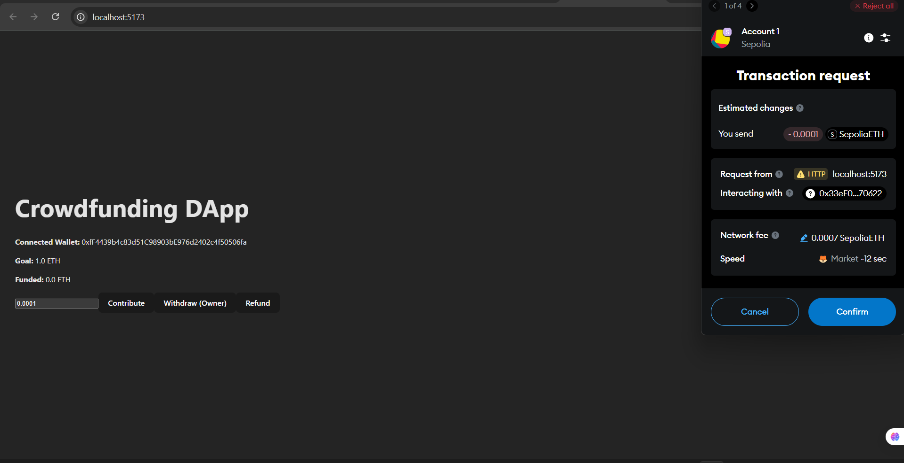
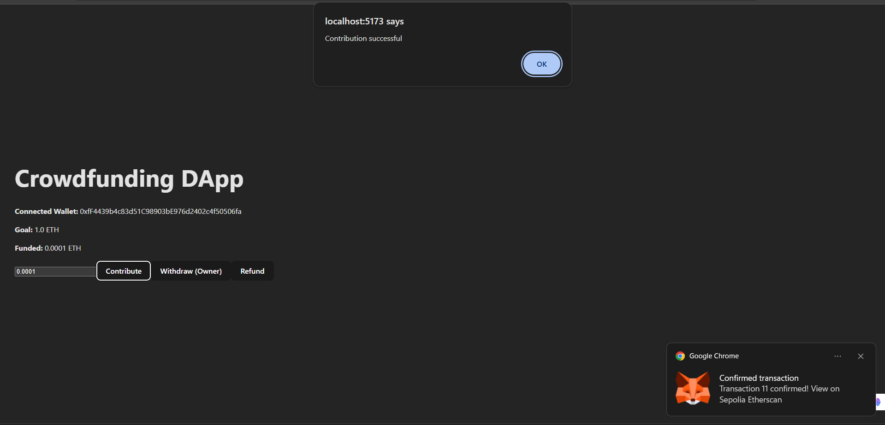
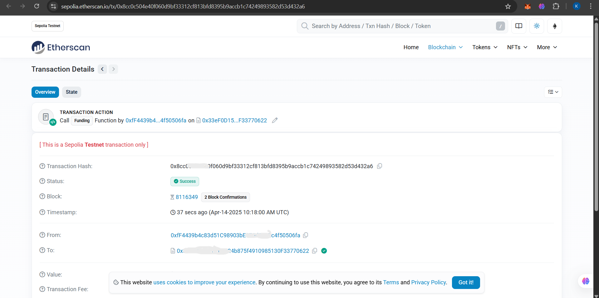

#  CrowdFunding DApp

A fully functional **Decentralized Crowdfunding Application** built using **Solidity**, **Hardhat**, **React**, and **Ethers.js**. Users can fund campaigns using **MetaMask**, and campaign owners can withdraw funds upon reaching the goal. Refunds are automatically enabled if the deadline expires without reaching the target.

---

##  Features

- Users can contribute ETH to a campaign.
- Deadlines ensure funds are raised within a set time.
- Automatic goal check — marks campaign complete once goal is met.
- Refund system if funding goal isn't met by the deadline.
- Only campaign owner can withdraw funds.
- MetaMask integration for transactions.

---

##  Tech Stack

- **Solidity** – Smart contracts
- **Hardhat** – Smart contract development & testing
- **React.js** – Frontend framework
- **Ethers.js** – Ethereum blockchain interaction
- **MetaMask** – Wallet connection
- **Alchemy / Sepolia Testnet** – Contract deployment

---

##  Screenshots

| Contribute ETH | Success Status | Etherscan Verification |
|----------------|------------------|-------------------|
|  |  |  |

---

##  Local Setup

### 1. Clone the Repo

```bash
git clone https://github.com/Kruthik-S/CrowdFunding-Dapp-solidity.git
cd CrowdFunding-Dapp-solidity
2. Install Dependencies

cd backend
npm install
cd ../frontend
npm install
3. Create .env file (inside backend/)

ALCHEMY_API_KEY=your_alchemy_key
PRIVATE_KEY=your_private_key


4. Compile and Deploy Contracts

cd backend
npx hardhat compile
npx hardhat node
npx hardhat run scripts/deploy.js --network sepolia
Copy the deployed contract address and paste it into your frontend’s config.

5. Start the Frontend

cd frontend
npm start
How It Works
funding() allows users to contribute ETH.

withdraw() allows the campaign owner to collect the funds if goal is reached.

refund() allows users to reclaim their ETH if deadline passes and goal not met.

 MetaMask Connection
Ensure MetaMask is installed and connected to the Sepolia testnet. On your first visit, MetaMask will prompt for connection approval.

Test Cases (Hardhat)
Inside test/ folder:


npx hardhat test
Covers:

Funding by multiple users

Withdraw by owner

Refund after deadline

License
MIT License © 2025 Kanu Prieya Kavya Garg Kruthik S 

